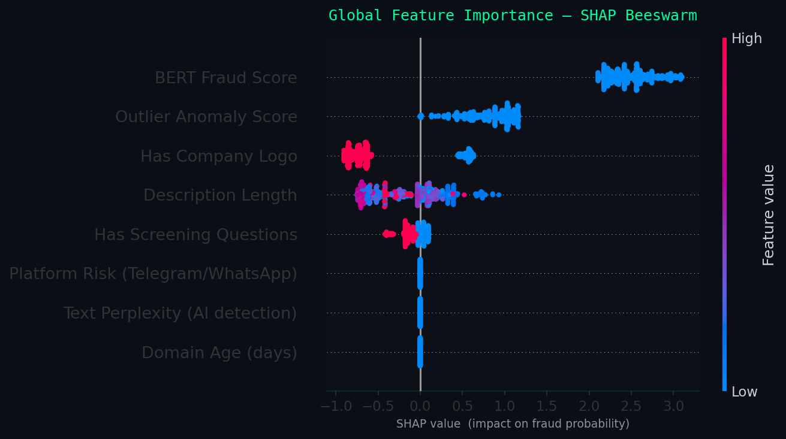

# Guardian Recruit — Fraud Detection System

[](https://huggingface.co/spaces/ijih14/guardian-recruit)

**University of North Texas | DTSC 5082 Capstone**

**Team:**
- Isagani Julian Hernandez — Fusion Layer, SHAP Explainability, Data Pipeline
- Hemanth Kumar Gunda — NLP Stream (BERT)
- Srijitha Ungarala — NLP Stream (Preprocessing & Linguistic EDA)
- Kusuma Satya Sreeja Chalasani — Outlier Detection Stream (IsolationForest)

---

## Overview

Guardian Recruit is a hybrid AI system for detecting fraudulent job postings. It combines three independent streams into a single fraud probability score with explainability.

```
Job Posting
  ├── Stream A: BERT fine-tuned NLP      → bert_score    (0.0–1.0)
  ├── Stream B: IsolationForest outlier  → outlier_score (float)
  └── Fusion:   XGBoost meta-classifier  → fraud_score   (0.0–1.0)
                                            + SHAP reasoning summary
```

**Model Performance (Validation Set):**
| Metric | Score |
|--------|-------|
| ROC-AUC | 0.9718 |
| Accuracy | 0.99 |
| Fraud F1 | 0.8439 |
| False Negatives | 30 |
| False Positives | 7 |

---

## Directory Structure

```
Guardian-Recruit-Fraud-Detection/
├── app.py                          # Streamlit demo app
├── requirements.txt                # Python dependencies
│
├── data/
│   ├── raw/                        # Original EMSCAD dataset (2014)
│   ├── processed/                  # Train / val / test splits + augmented training set
│   │   ├── train_clean_v1.csv      # Cleaned training data (8,696 rows)
│   │   ├── train.csv / val.csv / test.csv
│   │   ├── FINAL_AUGMENTED_TRAINING.csv   # SMOTENC + synthetic rows (17,342 rows)
│   │   └── synthetic_fraud_2026.csv       # 200 template-generated 2026-era fraud rows
│   ├── external/                   # Scraped 2026 legitimate job listings
│   └── chroma_db/                  # ChromaDB vector store for RAG explainer
│
├── models/
│   ├── nlp_bert.pth                # Fine-tuned BERT weights (Stream A)
│   ├── outlier_forest.pkl          # IsolationForest model (Stream B)
│   └── fusion_xgb.json             # XGBoost fusion model (Fusion Layer)
│
├── notebooks/
│   ├── 01_Initial_EDA.ipynb        # Data understanding & splitting
│   ├── 02_nlp_stream_training.ipynb # BERT fine-tuning (Colab T4 GPU)
│   ├── 03_outlier_phase3.ipynb     # IsolationForest training + confusion matrix
│   ├── 04_fusion_layer_shap.ipynb  # XGBoost fusion + SHAP (Colab T4 GPU)
│   ├── 05_live_scraper_test.ipynb  # 2026 live data validation
│   ├── 06_data_augmentation.ipynb  # SMOTENC + synthetic fraud generation
│   └── sandbox/                    # Individual exploration notebooks
│
├── src/
│   ├── main.py                     # End-to-end pipeline: score(job_posting) → dict
│   ├── preprocessing.py            # Data cleaning (GuardianCleaner)
│   ├── nlp_stream.py               # Stream A: predict_proba(text) → float
│   ├── outlier_stream.py           # Stream B: anomaly_score(row) → float
│   ├── fusion_layer.py             # Fusion: predict(row) → dict
│   ├── meta_features.py            # Adversarial features: domain age, perplexity, platform risk
│   ├── text_signals.py             # Keyword signal engine (Tier 1 + Tier 2 + 2026-era)
│   ├── shap_explainer.py           # SHAP reasoning summaries per prediction
│   ├── explainer.py                # LLM narrative explanation (Groq → Ollama → template)
│   ├── vector_store.py             # ChromaDB RAG for similar fraud case retrieval
│   ├── scraper.py                  # 2026 job listing ETL pipeline
│   └── pipeline.py                 # Batch scoring utilities
│
├── scripts/
│   ├── generate_synthetic_fraud.py # Generate 2026-era synthetic fraud rows
│   ├── validate_signals.py         # Validate keyword signal coverage on training data
│   └── smoke_test.py               # Quick end-to-end sanity check
│
└── tests/
    └── test_outlier_stream.py      # Unit tests for outlier stream
```

---

## Quick Start

### 1. Install dependencies
```bash
python -m venv .venv
source .venv/bin/activate  # Windows: .venv\Scripts\activate
pip install -r requirements.txt
```

### 2. Add model files
Place the following in `models/` (download from shared Google Drive):
- `nlp_bert.pth`
- `outlier_forest.pkl`
- `fusion_xgb.json`

### 3. Score a job posting
```python
from src.main import score
from src.shap_explainer import explain_shap

result = score({
    "title": "Remote Operations Assistant",
    "description": "Earn up to $600/week. Contact us on Telegram. Start this week.",
    "has_company_logo": 0,
    "has_questions": 0,
})

print(result["label"])        # FRAUD or LEGITIMATE
print(result["fraud_score"])  # 0.0 – 1.0

shap = explain_shap(result)
print(shap["reasoning_summary"])
# "Flagged because: NLP fraud pattern score (+86%), No company logo (+7%), ..."
```

### 4. Run the demo app
```bash
streamlit run app.py
```

### 5. Run smoke tests
```bash
python src/main.py
python scripts/smoke_test.py
```

---

## What Was Built

### Phase 1 — EDA & Data Splitting
- Class-stratified train/val/test splits from EMSCAD dataset (17,880 rows, 4.85% fraud rate)
- Missing value analysis, keyword frequency EDA, metadata visualisations

### Phase 2 — Dual-Stream Models
- **Stream A (BERT):** Fine-tuned `bert-base-uncased` on fraud detection, F1 0.8376 on val set
- **Stream B (IsolationForest):** Anomaly detection on 7 metadata features
- **Fusion Layer (XGBoost):** Meta-classifier combining both stream scores, ROC-AUC 0.9718

### Phase 3 — Adversarial Robustness & Explainability
- **Adversarial Synthesis:** 200 template-generated 2026-era fraud rows with 12 modern signal types (crypto salary, Telegram interviews, equipment deposits, task scams, etc.)
- **2026 Keyword Signals:** Extended `text_signals.py` with 8 new Tier 2 signal categories grounded in FBI IC3, FTC, and BBB 2024–2026 reports
- **New Meta-Features:** Domain age (WHOIS), text perplexity (GPT-2), platform risk (Telegram/WhatsApp/Signal detection)
- **SHAP Explainability:** Per-prediction reasoning summaries — *"Flagged because: AI-generated text likelihood (+38%), Domain age < 30 days (+27%)"*
- **RAG Explainer:** LLM narrative explanations grounded in similar known fraud cases (Groq → Ollama → template fallback)

---

## Deployment & Production Readiness

### Prediction Mode
Guardian Recruit supports two operating modes:

| Mode | Implementation | Use Case |
|------|---------------|----------|
| **Real-time** | `pipeline.predict(posting)` — single posting scored in ~1–3 seconds | Streamlit demo, future REST API endpoint |
| **Batch** | `pipeline.py` batch loop over DataFrame rows | Nightly re-scoring of job board listings |

The Streamlit app (`app.py`) serves as the working interface mockup: a recruiter or platform operator pastes a job posting's fields, clicks **RUN THREAT ANALYSIS**, and receives a fraud probability score, SHAP reasoning summary, triggered signal indicators, and similar known fraud cases retrieved from the ChromaDB vector store.

### Conceptual Production Architecture
```
Job Board Platform
  └── POST /score  →  Guardian API (FastAPI wrapper around pipeline.predict)
                          ├── Stream A: BERT inference
                          ├── Stream B: IsolationForest
                          ├── Meta-features: WHOIS + perplexity + platform risk
                          ├── Fusion: XGBoost → fraud_score
                          └── Response: { label, fraud_score, explanation, shap }
```

> **TODO (team):** Wrap `pipeline.predict()` in a FastAPI endpoint (`POST /score`) with a Pydantic request model matching the posting dict schema. This converts the Streamlit demo into a deployable microservice.

### Monitoring & Maintenance Plan

| Signal | What to Watch | Action Threshold |
|--------|--------------|-----------------|
| **Score distribution drift** | Weekly histogram of `fraud_score` on new postings vs. baseline | Alert if mean shifts > 0.05 |
| **False negative reports** | Track postings flagged as LEGITIMATE that users later report as fraud | Trigger retraining if FN rate > 5% over 30-day window |
| **Keyword signal coverage** | Run `scripts/validate_signals.py` monthly on new postings | Add new signal patterns when coverage drops |
| **BERT drift** | Compare BERT embedding cosine similarity of new postings vs. training set | Fine-tune if distribution shift detected |
| **WHOIS / perplexity feature health** | Log % of postings where domain_age_days = -1 (lookup failure) | Investigate if > 40% returning fallback value |

**Retraining trigger:** When new labelled fraud data accumulates (e.g., from reported false negatives or a quarterly scrape), retrain the XGBoost fusion layer first (fast, ~minutes on CPU). BERT fine-tuning requires GPU and should be re-evaluated every 6 months or after major fraud pattern shifts.

> **TODO (team):** Implement a logging wrapper in `pipeline.py` that writes each prediction (timestamp, fraud_score, triggered_signals, latency_ms) to a CSV or database table. This log becomes your monitoring data source.

---

## Explainable AI (XAI)

### Feature Importance — Global Explanation

The XGBoost fusion model was trained on 8 meta-features. SHAP values computed on the validation set show the following global importance ranking:

| Rank | Feature | What It Measures | Direction |
|------|---------|-----------------|-----------|
| 1 | `bert_score` | NLP fraud probability from fine-tuned BERT | Higher → more fraudulent |
| 2 | `has_company_logo` | Whether a company logo is present | Absent → more fraudulent |
| 3 | `outlier_score` | IsolationForest anomaly score on metadata | Lower (more anomalous) → more fraudulent |
| 4 | `has_questions` | Whether screening questions are included | Absent → more fraudulent |
| 5 | `desc_len` | Character length of job description | Very short → suspicious |
| 6 | `platform_risk` | Presence of WhatsApp/Telegram/Signal in text | Present → more fraudulent |
| 7 | `domain_age_days` | Age of company domain (WHOIS) | < 30 days → suspicious |
| 8 | `text_perplexity` | GPT-2 perplexity (low = AI-generated text) | < 80 → suspicious |



*Each dot is one of 500 validation postings. Horizontal position = SHAP value (impact on fraud probability). Colour = feature value (red = high, blue = low). Features ranked top-to-bottom by mean absolute SHAP.*

### Local Explanation — Example Prediction

A posting with the following properties was scored at **fraud_score = 0.94 (FRAUD)**:

```
Title:       "Remote Operations Coordinator"
Description: "Earn up to $750/week. Contact our coordinator on WhatsApp.
              Equipment deposit of $200 refunded after 90 days."
has_logo:    False
has_questions: False
```

SHAP reasoning summary produced by `src/shap_explainer.py`:

> *"Flagged because: NLP fraud pattern score (+86%), No company logo (+7%), Outlier metadata pattern (+4%), No screening questions (+2%)"*

Triggered keyword signals: `compensation_guarantee`, `messaging_app_interview`, `equipment_bait`

**Interpretation:** The BERT model detected fraud-associated language as the dominant signal. The absence of a company logo and screening questions were corroborating structural indicators. The keyword engine independently flagged three 2026-era scam patterns, and the fused XGBoost score exceeded the 0.30 threshold — resulting in a FRAUD verdict.

> **TODO (team):** Run a real posting through `streamlit run app.py`, screenshot the output panel (verdict + SHAP breakdown + signal indicators), and embed it here as a concrete local explanation example.

---

## Bias & Fairness Audit

### Subgroup Analysis — Validation Set (n = 1,877)

The following fraud rates were observed across subgroups in the held-out validation set. These reflect **ground-truth label rates in the data**, not model predictions — they establish where the training signal comes from and where the model may be biased.

#### By Geography (countries with n ≥ 20)

| Country | Fraud Rate | n |
|---------|-----------|---|
| Australia (AU) | 20.0% | 20 |
| United States (US) | 7.0% | 1,125 |
| Canada (CA) | 5.1% | 39 |
| Great Britain (GB) | 1.6% | 250 |
| Germany (DE) | 0.0% | 42 |
| Greece (GR) | 0.0% | 95 |
| India (IN) | 0.0% | 36 |
| New Zealand (NZ) | 0.0% | 34 |

**Risk:** The model was trained predominantly on US-origin postings (60% of validation set). It may under-detect fraud patterns that differ by region (e.g., Europe, South Asia). Non-English postings are likely scored unreliably by the BERT stream, which was fine-tuned on English text only.

#### By Employment Type

| Employment Type | Fraud Rate | n |
|----------------|-----------|---|
| Part-time | 11.0% | 100 |
| Full-time | 4.2% | 1,211 |
| Contract | 2.5% | 160 |
| Temporary | 0.0% | 20 |
| Other | 0.0% | 17 |

**Risk:** Part-time postings are flagged as fraud at 2.6× the rate of full-time postings in the training data. The model may over-flag legitimate part-time and gig-economy roles, particularly in sectors like retail, hospitality, and caregiving.

#### By Industry (top fraud-rate industries, n ≥ 10)

| Industry | Fraud Rate | n |
|----------|-----------|---|
| Oil & Energy | 33.3% | 27 |
| Accounting | 22.2% | 18 |
| Hospital & Health Care | 21.3% | 47 |
| Real Estate | 17.4% | 23 |
| Design | 16.7% | 12 |
| Financial Services | 8.0% | 75 |

**Risk:** Healthcare and financial services have elevated fraud rates in the training data, which may lead to disproportionate flagging of legitimate postings in those sectors.

#### By Structural Features

| Feature | Fraud Rate | n |
|---------|-----------|---|
| No company logo | 16.7% | 372 |
| Has company logo | 1.9% | 1,505 |
| No screening questions | 7.0% | 975 |
| Has screening questions | 2.5% | 902 |

**Risk:** Logo presence is one of the strongest signals but is a structural feature, not semantic. Legitimate small businesses and startups that do not upload a logo on a job board may be systematically over-scored.

### Ethical Implications

| Concern | Description |
|---------|-------------|
| **False positives on legitimate SMBs** | Small businesses without logos or screening systems may be incorrectly flagged, creating reputational harm for legitimate employers |
| **Geographic bias** | Model trained on a US/UK-centric 2014 dataset; performance on postings from underrepresented regions (South Asia, Latin America, Africa) is unknown and likely lower |
| **Language bias** | BERT stream fine-tuned on English only; non-English postings receive unreliable NLP scores |
| **Temporal bias** | The 2014 EMSCAD dataset predates the gig economy boom, remote work normalisation, and modern fraud tactics — synthetic augmentation partially addresses this but does not fully close the gap |
| **Threshold asymmetry** | Threshold set at 0.30 (prioritising recall) means the system accepts more false positives to reduce missed fraud — this trade-off affects legitimate employers more than job seekers |

### Fairness Mitigation Steps Taken

- Threshold tuned to 0.30 to minimise false negatives (missed fraud) at the cost of slightly elevated false positives
- Keyword signal engine (`text_signals.py`) provides independent, interpretable flagging that can be audited without ML opacity
- SHAP explanations surface which features drove each decision, enabling human review of borderline cases
- ChromaDB RAG retrieves similar known fraud cases so reviewers can compare context before acting on a flag

> **TODO (team):** Run `pipeline.predict()` on a sample of postings stratified by employment type and country. Compare predicted fraud rates to ground-truth rates from the table above. Document the false positive rate per subgroup. This becomes your quantitative fairness audit for the writeup.

---

## Key Design Decisions

| Decision | Rationale |
|----------|-----------|
| XGBoost for fusion | Handles small meta-feature matrix well; native SHAP support |
| BERT over TF-IDF | Captures semantic fraud patterns beyond keyword matching |
| Template synthesis over LLM generation | Reproducible, no API dependency, guaranteed signal injection |
| `domain_age_days = -1` as training fallback | WHOIS too slow for 17k rows; feature contributes at inference time on live postings |
| Threshold = 0.3 | Optimised for recall on fraud class — missing fraud is worse than a false alarm |

---

## Limitations

- Synthetic training data is template-generated, not real labelled 2026 fraud postings
- `domain_age_days` and `text_perplexity` used neutral fallback values during bulk training — SHAP importance is low for these features on the validation set but they activate at inference time
- Perplexity threshold (< 80 = AI-generated) is heuristic and not empirically calibrated
- WHOIS lookups fail silently for private domain registrations (~30% of domains)

---

## Environment Variables

Create a `.env` file in the project root:
```
GROQ_API_KEY=gsk_...        # For LLM narrative explanations (free tier)
```

---

## Team Roles & Responsibilities

| Team Member | Role | Deliverables |
|-------------|------|-------------|
| **Isagani Julian Hernandez** | Team Lead · System Architecture · Fusion Layer · Explainability · Data Pipeline · Model Deployment | `src/fusion_layer.py`, `src/shap_explainer.py`, `src/explainer.py`, `src/meta_features.py`, `src/text_signals.py`, `scripts/generate_synthetic_fraud.py`, `app.py`, `notebooks/04_fusion_layer_shap.ipynb`, `notebooks/06_data_augmentation.ipynb` |
| **Hemanth Kumar Gunda** | NLP Stream A — BERT Fine-tuning | `src/nlp_stream.py`, `models/nlp_bert.pth`, `notebooks/02_nlp_stream_training.ipynb` |
| **Srijitha Ungarala** | NLP Stream A — Preprocessing & Linguistic EDA | `src/preprocessing.py`, `notebooks/01_Initial_EDA.ipynb` |
| **Kusuma Satya Sreeja Chalasani** | Outlier Detection Stream B — IsolationForest | `src/outlier_stream.py`, `models/outlier_forest.pkl`, `notebooks/03_outlier_phase3.ipynb`, `tests/test_outlier_stream.py` |

---

## Branching Convention
| Branch | Purpose |
|--------|---------|
| `main` | Stable, reviewed code only |
| `feature/fusion-evaluation` | Current active branch |
| `feature/nlp-semantics` | Stream A NLP work |
| `feature/outlier-detection` | Stream B outlier work |
